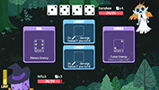

<div align="center"><a href="https://haxe.org/"></a></div>

# Awesome Haxe Game Development [](https://awesome.re)

A curated list of game development resources for **[Haxe 4](https://haxe.org/)**, a high level strictly typed programming language which is used to produce cross-platform native code.

Feel free to update it.

## Contents
* [Game engines](#game-engines)
* [Physics](#physics)
* [Architecture](#architecture)
* [Networking](#networking)
* [Serialization and storage](#serialization-and-storage)
* [Games](#games)
* [Miscellaneous](#miscellaneous)
* [Jobs](#jobs)
* [Articles](#articles)
* [Other haxe lists](#other-haxe-lists)

## Game engines

Those are Haxe 4 compatible game engines.

|Engine                                                       |Target                        |                                                         Description|
|-------------------------------------------------------------|------------------------------|--------------------------------------------------------------------|
|[Armory (Kha)](https://github.com/armory3d/armory)           |Web, Mobile, Desktop, Consoles|An open-source 3D game engine with full Blender integration.        |
|[Away3D](https://github.com/openfl/away3d)                   |Web, Mobile, Desktop          |An open source, real-time 3D engine for OpenFL.                     |
|[HaxeFlixel (OpenFL)](https://github.com/HaxeFlixel/flixel)  |Web, Mobile, Desktop, Consoles|Free, cross-platform 2D game engine powered by OpenFL.              |
|[Haxegon (OpenFL)](https://github.com/haxegon/haxegon)       |Web, Mobile, Desktop, Consoles|A programming library for beginners. Powered by OpenFL and Starling.|
|[Heaps](https://github.com/HeapsIO/heaps)                    |Web, Mobile, Desktop, Consoles|High Performance Game Framework.                                    |
|[hxdefold](https://github.com/hxdefold/hxdefold)             |Web, Mobile, Desktop          |Haxe/Lua externs for Defold game engine.                            |
|[OpenFL](https://github.com/openfl/openfl)                   |Web, Mobile, Desktop, Consoles|Interactive game and app development library.                       |
|[Starling](https://github.com/openfl/starling)               |Web, Mobile, Desktop          |The "Cross-Platform Game Engine", a popular Stage3D framework.      |
|[Stencyl (OpenFL)](https://github.com/Stencyl/stencyl-engine)|Web, Mobile, Desktop          |Create Flash, HTML5, iOS, Android, and desktop games with no code.  |
|[unreal.hx](https://github.com/proletariatgames/unreal.hx)   |Web, Mobile, Desktop, Consoles|Haxe Integration for Unreal.                                        |


|Low-level Engine                                   |Target                       |Description                                                            |
|---------------------------------------------------|-----------------------------|-----------------------------------------------------------------------|
|[Kha](https://github.com/Kode/Kha)                 |Web, Mobile, Desktop, Console|Ultra-portable, high performance, open source multimedia framework.    |
|[Lime](https://github.com/openfl/lime)             |Web, Mobile, Desktop         |A flexible, lightweight layer for Haxe cross-platform developers.      |
|[linc_glfw](https://github.com/Sunjammer/linc_glfw)|Desktop                      |GLFW binding (multi-platform library for OpenGL, OpenGL ES and Vulkan).|
|[NME](https://github.com/haxenme/nme)              |Web, Mobile, Desktop         |A cross-platform native backend for Haxe projects.                     |


## Physics
|Library                                               |Description                                                                                                |
|------------------------------------------------------|-----------------------------------------------------------------------------------------------------------|
|[echo](https://github.com/AustinEast/echo/)           |Simple Physics Library.                                                                                    |
|[haxebullet](https://github.com/armory3d/haxebullet)  |Bullet 3D Physics for Haxe.                                                                                |
|[nape-haxe4](https://github.com/HaxeFlixel/nape-haxe4)|Physics Engine (the original Haxe3 version of nape can be found [here](https://github.com/deltaluca/nape)).|


## Architecture
```
IoC == Inversion of Control  
EC == Entity Component  
ECS == Entity-Component-System
FSM == Finite State Machine
MVC == Model View Controller
```

|Library                                            |Architecture|                                        Description                           |
|---------------------------------------------------|------------|------------------------------------------------------------------------------|
|[awe6](https://github.com/hypersurge/awe6)         |IoC, EC     |The inverted game framework, is a development tool focused on Future Proofing.|
|[ecx](https://github.com/eliasku/ecx)              |ECS         |An Entity Component System framework.                                         |
|[hexMachina](https://github.com/DoclerLabs/hexCore)|MVC         |A powerful multi-modular MVC framework.                                       |
|[OSIS](https://github.com/Dvergar/OSIS)            |ECS         |Entity Component System architecture with networking support.                 |


## Networking
|Library                                                             |             Description                      |
|--------------------------------------------------------------------|----------------------------------------------|
|[Anette](https://github.com/Dvergar/Anette)                         |Simple network library (no UDP).              |
|[colyseus-hx](https://github.com/colyseus/colyseus-hx)              |Multiplayer Game Client.                      |
|[haxe-simple-peer (js)](https://github.com/melonin/haxe-simple-peer)|Haxe externs for simple-peer.                 |
|[hxWebSockets](https://github.com/ianharrigan/hxWebSockets)         |Websockets for all Haxe platforms.            |
|Built-in                                                            |Heaps, OpenFL (HaxeFlixel & co), Kha (Armory).|


## Serialization and storage
|Library                                          |        Description                                        |
|-------------------------------------------------|-----------------------------------------------------------|
|[Bits](https://github.com/RealyUniqueName/Bits)  |Binary bit flags with unlimited amount of bits.            |
|[CastleDB](https://github.com/ncannasse/castle)  |A structured static database easing collaboration.         |
|[hxbit](https://github.com/ncannasse/hxbit)      |A binary serialization and network synchronization library.|
|[PODStream](https://github.com/Dvergar/PODStream)|Plain Old Data serializer.                                 |


## Games
|Game                                                                       |Platform            |Engine             |Screenshot                                    |
|---------------------------------------------------------------------------|--------------------|-------------------|----------------------------------------------|
|**RELEASED**                                                               |                    |                   |                                              |
|[Dead Cells](https://dead-cells.com/)                                      |Desktop, Consoles   |Heaps              |          |
|[Defender's Quest](http://www.defendersquest.com/)                         |Desktop, Consoles   |HaxeFlixel (OpenFL)|     |
|[Dicey Dungeons](http://diceydungeons.com/)                                |Desktop, Consoles   |Haxegon (OpenFL)   |      |
|[Evoland](http://evoland.shirogames.com/)                                  |Desktop, Mobile     |Heaps              |             |
|[Northgard](http://northgard.net/)                                         |Desktop             |Heaps              |           |
|[Papers, Please](http://papersplea.se/)                                    |Desktop, iOS, PsVita|OpenFL             |       |
|[Pocket Kingdom](https://store.steampowered.com/app/462620/Pocket_Kingdom/)|Desktop             |HaxePunk (OpenFL)  |      |
|[rymdkapsel](https://rymdkapsel.com/)                                      |Desktop, Mobile     |OpenFL             |          |
|[The Westport Independent](http://www.doublezeroonezero.com/westport.html) |Desktop, Mobile     |Luxe               ||
|**IN DEVELOPMENT**                                                         |                    |                   |                                              |
|[Darksburg](https://store.steampowered.com/app/939100/Darksburg/)          |Desktop, ?          |Heaps              |           |
|[Frontier Story](https://twitter.com/jmw327)                               |Desktop             |Heaps              |      |

More showcase :
* [OpenFL showcase](https://www.openfl.org/showcase)
* [HaxeFlixel showcase](https://haxeflixel.com/showcase/)
* [itch.io showcase](https://itch.io/games/made-with-haxe)
* [HaxePunk showcase](https://haxepunk.com/games/)
* [Flambe showcase](https://github.com/aduros/flambe/wiki/Showcase)
* [Kha showcase](https://github.com/Kode/Kha/wiki/Games-Built-With-Kha)

## Miscellaneous
|Type                 |Library                                                                    | Description                                                                                                                                                                     |
|---------------------|---------------------------------------------------------------------------|---------------------------------------------------------------------------------------------------------------------------------------------------------------------------------|
|Animation            |[spine-hx](https://github.com/jeremyfa/spine-hx)                           |Spine runtime for Haxe automatically converted from the official Java/libgdx runtime. For Heaps: [Heaps-Spine](https://github.com/Beeblerox/Heaps-Spine).                        |
|_                    |HaxeFlixel                                                                 |Spine parser via [flixel-addons](https://github.com/HaxeFlixel/flixel-addons/tree/dev/flixel/addons/editors).                                                                    |
|_                    |[Heaps-Spine](https://github.com/Beeblerox/Heaps-Spine)                    |Spine player for heaps.                                                                                                                                                          |
|Color manipulation   |[nxColor](https://github.com/oscarcs/nxColor)                              |Color manipulation library.                                                                                                                                                      |
|Collision            |[differ](https://github.com/snowkit/differ)                                |A separation axis theorem collision library.                                                                                                                                     |
|Data structures      |[polygonal-ds](https://github.com/polygonal/ds)                            |Data structures for games.                                                                                                                                                       |
|Editor               |[flixel-studio](https://github.com/Dovyski/flixel-studio)                  |In-game editor for HaxeFlixel.                                                                                                                                                   |
|Procedural generation|[Dungeon builder](https://github.com/julsam/dungeon-builder)               |A set of dungeon generation algorithm (works w/ hx4 w/ minor changes).                                                                                                           |
|Localization         |[firetongue](https://github.com/larsiusprime/firetongue)                   |A translation/localization framework written in Haxe.                                                                                                                            |
|Map parser           |[PyxelEdit Map Importer](https://github.com/Dvergar/PyxelEdit-Map-Importer)|Parser for maps generated by the editor PyxelEdit.                                                                                                                               |
|_                    |Heaps                                                                      |Built-in parser for Tiled.                                                                                                                                                       |
|_                    |HaxeFlixel                                                                 |Parser for Tiled & Ogmo via [flixel-addons](https://github.com/HaxeFlixel/flixel-addons/tree/dev/flixel/addons/editors).                                                         |
|Math helpers         |[hxmath](https://github.com/tbrosman/hxmath)                               |A game-oriented math library for the Haxe language.                                                                                                                              |
|_                    |[haxe-glm](https://github.com/hamaluik/haxe-glm)                           |A toolset for using 2, 3, and 4 dimensional vectors and matrices, as well as quaternions.                                                                                        |
|_                    |[hx-vector2d](https://github.com/markknol/hx-vector2d)                     |Worlds most complete Vector2d / Point class. With operator overloading.                                                                                                          |
|Modding              |[polymod](https://github.com/larsiusprime/polymod)                         |An atomic modding framework for Haxe games/apps.                                                                                                                                 |
|Particles            |[Sparkler](https://github.com/RudenkoArts/sparkler)                        |Modular Particle System.                                                                                                                                                         |
|Monetization         |[extension-iap](https://github.com/charmdev/extension-iap)                 |Provides an access to in-app purchases (iOS) and in-app billing (Android) for OpenFL projects using a common API. Fork of [this](https://github.com/HaxeExtension/extension-iap).|
|Pathfinding          |[pathfinder](https://github.com/hypersurge/pathfinder)                     |Easy A* pathfinding algorithm.                                                                                                                                                   |
|Sprite               |[haxe-aseprite](https://github.com/PongoEngine/haxe-aseprite)              |Parser for .ase and .aseprite files.                                                                                                                                             |
|Steam                |[SteamWrap](https://github.com/larsiusprime/SteamWrap)                     |Haxe native extension for the Steam API.                                                                                                                                         |
|Texture Packer       |[hxpk](https://github.com/bendmorris/hxpk)                                 |Port of the libGDX Texture Packer.                                                                                                                                               |
|Tweening             |[actuate](https://github.com/jgranick/actuate)                             |A flexible, fast "tween" library.                                                                                                                                                |
|_                    |[YATL](https://github.com/Yanrishatum/yatl)                                |Yet Another (Haxe) Tweening Library.                                                                                                                                             |
|UI                   |[domkit](https://github.com/ncannasse/domkit)                              |CSS Components based strictly typed UI framework.                                                                                                                                |
|_                    |[flixel-ui](https://github.com/HaxeFlixel/flixel-ui)                       |GUI library for HaxeFlixel.                                                                                                                                                      |
|_                    |[HaxeUI](http://haxeui.org/)                                               |UI library with multiple framework backends (HTML5, Kha, OpenFL, PixiJS, WxWidgets, and a number of others as works in progress)                                                 |                                                                                                                                                   |

## Jobs
* [Squidly](https://twitter.com/squuuidly/status/1243925472121151488) - Opened up [a bounties page](https://github.com/chosencharacters/squidBounties) for HaxeFlixel features and one of the them is [already claimed](https://github.com/chosencharacters/squidBounties/issues/2).
* [Kaleido Games](https://twitter.com/KaleidoGames) - Bounty to make OpenFL work with [(FNA/UWP)](https://community.openfl.org/t/bounty-to-make-openfl-work-with-fna-uwp-300usd-150usd/12328).
* [NX Studio](https://studionx.ru/) - Looking for [a Haxe programmer](https://hh.ru/vacancy/35432606) to work on their game called "Throne Rush". _(Moscow, Russia)_
* [Shiro Games](https://twitter.com/ncannasse/status/1166704326485651457) - Recruiting for different roles to expand their studio and work on upcoming, exciting projects!
* Lars Doucet's list of various [open bounties](https://github.com/larsiusprime/larsBounties/issues).

_Source: haxe.io_

## Articles
* [Flash is dead, long live OpenFL!](http://gamasutra.com/blogs/LarsDoucet/20140318/213407/Flash_is_dead_long_live_OpenFL.php)
* [Flash is gone, what now?](https://www.linkedin.com/pulse/flash-gone-what-now-matan-uberstein/)
* [How I wrote my own 3D game engine and shipped a game with it in 20 months](https://kircode.com/post/how-i-wrote-my-own-3d-game-engine-and-shipped-a-game-with-it-in-20-months)
* [Building 42 games within a year — Insane game development](https://medium.com/@mknol/building-42-games-within-a-year-insane-game-development-5340d506068f)
* [Porting to console via Unity](https://do-games.com/blog/the-adventure-pals-console-tech-part1)

## Other haxe lists
* [awesome haxe](https://github.com/nadako/awesome-haxe)
* [awesome snowkit](https://github.com/anissen/awesome-snowkit)
* [awesome haxe js](https://github.com/MatthijsKamstra/awesome-haxe-js)

## License

[](https://creativecommons.org/publicdomain/zero/1.0/)
